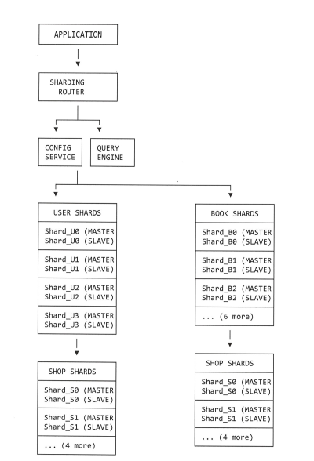

# Домашнее задание к занятию "Репликация и масштабирование. Часть 2" - Котов Г.И.

### Задание 1
Опишите основные преимущества использования масштабирования методами:

- активный master-сервер и пассивный репликационный slave-сервер;
- master-сервер и несколько slave-серверов;

Дайте ответ в свободной форме.

### Решение 1: 

1. Активный Master-сервер и пассивный репликационный Slave-сервер
Это классическая схема с одним мастером на запись и одним слейвом для подстраховки.

Основные преимущества:

- Повышение отказоустойчивости: Пассивный слейв служит "горячим" резервом. В случае падения мастера, слейв можно быстро перевести в роль нового мастера, минимизируя простой.

- Разгрузка для обслуживания: На слейве можно выполнять резервное копирование и запускать тяжелые аналитические запросы, не создавая нагрузки на основной мастер, что критично для производительности.

- Простота: Архитектура проста в настройке и администрировании по сравнению с более сложными схемами. Риски конфликтов данных отсутствуют.

Главная цель: Резервирование и повышение доступности, а не масштабирование производительности.

2. Master-сервер и несколько Slave-серверов
Это развитие первой схемы, где к одному мастеру подключается несколько подчиненных серверов.

Основные преимущества:

- Масштабирование чтения: Это главное преимущество. Вся нагрузка от SELECT-запросов распределяется между несколькими слейвами. Это позволяет обслуживать большое количество пользователей, которые в основном читают данные.

- Высокая доступность и отказоустойчивость: При выходе из строя одного слейва остальные продолжают работать и обслуживать запросы на чтение. Резервирование становится более надежным.

- Географическое распределение: Слейвы можно размещать в разных дата-центрах или регионах. Пользователи из разных частей мира будут читать данные с ближайшего к ним слейва, уменьшая задержку (latency).

Главная цель: Масштабирование нагрузки на чтение, географическое распределение и повышенная отказоустойчивость.

### Задание 2

Разработайте план для выполнения горизонтального и вертикального шаринга базы данных. База данных состоит из трёх таблиц:

- пользователи,
- книги,
- магазины (столбцы произвольно).

Опишите принципы построения системы и их разграничение или разбивку между базами данных.

Пришлите блоксхему, где и что будет располагаться. Опишите, в каких режимах будут работать сервера.

### Решение 2: 

